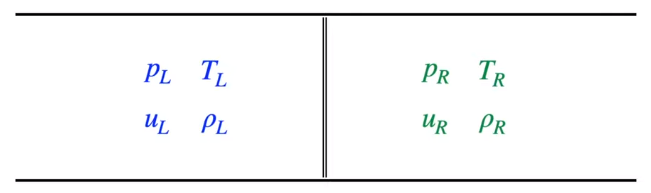
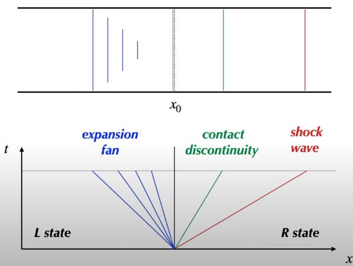
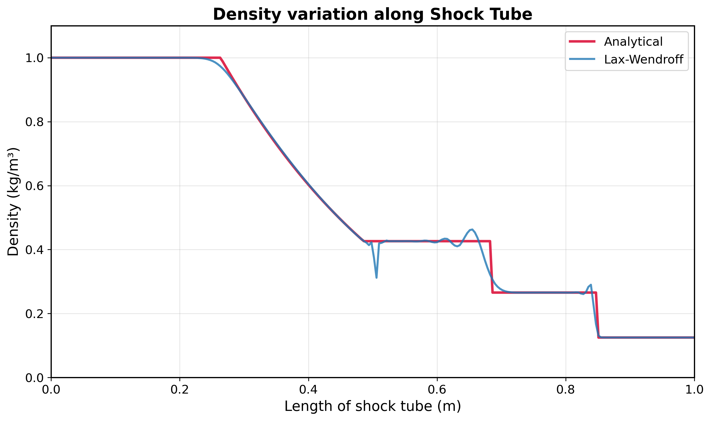
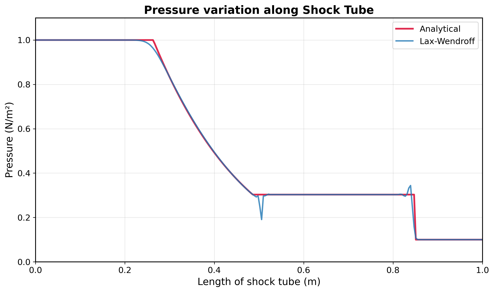
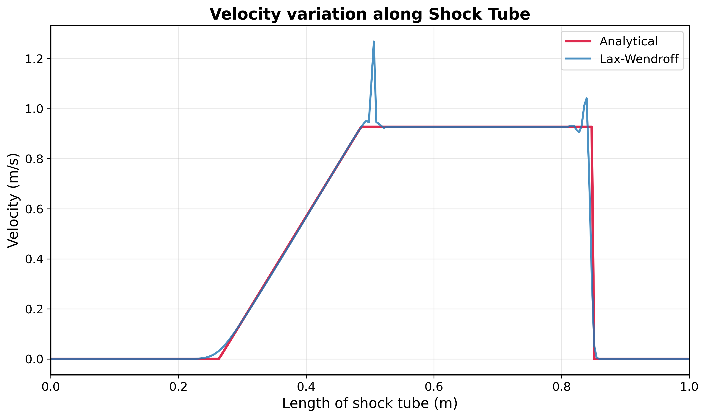
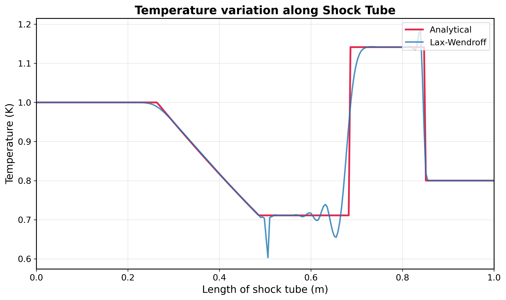

# CUDA Implementation of Lax-Wendroff Scheme for Sod's 1D Shock Tube Problem

This project was developed as part of **AE622 Computing of High Speed Flows**, a graduate-level course at the Indian Institute of Technology Bombay (IIT Bombay).

**Course Instructor:** [Prof. Krishnendu Sinha](https://www.hypersonic-cfd.com/people.html#krishna)  
**Department:** Aerospace Engineering, IIT Bombay

## Problem Overview

This project implements a CUDA-accelerated solution to Sod's 1D Shock Tube Problem using the Lax-Wendroff finite difference scheme. The implementation solves the 1D Euler equations numerically and compares the results with analytical solutions. 


Sod's Shock Tube Problem is a classic Riemann problem in computational fluid dynamics that involves solving the 1D Euler equations:

```
∂ρ/∂t + ∂(ρu)/∂x = 0
∂(ρu)/∂t + ∂(ρu² + p)/∂x = 0  
∂E/∂t + ∂(u(E + p))/∂x = 0
```

Where:
- ρ = density
- u = velocity  
- p = pressure
- E = total energy per unit volume

### Initial Conditions
- **Left state (x < 0.5)**: ρ = 1.0, p = 1.0, u = 0.0
- **Right state (x ≥ 0.5)**: ρ = 0.125, p = 0.1, u = 0.0
- **Domain**: x ∈ [0, 1]
- **Final time**: t = 0.2


*Initial conditions for Sod's Shock Tube Problem*


*Expected wave structure showing shock, contact discontinuity, and rarefaction wave*


## Project Structure

```
ShockTube-CUDA/
├── cuda/                     # CUDA implementation
│   ├── main.cpp              # Main program entry point
│   ├── shock_tube.h          # Class definition and interface
│   ├── shock_tube.cu         # CUDA implementation
│   ├── cuda_kernels.cu       # CUDA kernel functions
│   └── Makefile              # Build configuration
├── analytical/               # Analytical solution
│   └── analytical_shock_tube.py
├── visualize/                # Visualization tools
│   └── visualize_comparison.py
├── results/                  # Simulation output data
├── plots/                    # Generated plots
├── logs/                     # Log files
├── config.yaml               # Configuration file
├── requirements.txt          
└── README.md                 
```

## Prerequisites

### Hardware Requirements
- NVIDIA GPU with CUDA Compute Capability 5.0 or higher
- Minimum 2GB GPU memory
- 4GB+ system RAM

### Software Requirements
- **CUDA Toolkit** (version 10.0 or higher)
- **GCC/G++** compiler (version 7.0 or higher)
- **Python 3.7+** with required packages
- **Make** build system

### Python Dependencies
```bash
pip install -r requirements.txt
```


## Installation

### 1. Install CUDA Toolkit
```bash
# Ubuntu/Debian
sudo apt update
sudo apt install nvidia-cuda-toolkit

# Or download from NVIDIA website
# https://developer.nvidia.com/cuda-downloads
```

### 2. Verify CUDA Installation
```bash
nvcc --version
nvidia-smi
```

### 3. Clone and Build
```bash
git clone <repository-url>
cd ShockTube-CUDA

# Build CUDA implementation
cd cuda
make

# Install Python dependencies
cd ..
pip install -r requirements.txt
```

## Usage

### Quick Start
```bash
# Run complete simulation (analytical + numerical + visualization)
cd cuda
make run-default

# Generate plots
cd ../visualize
python visualize_comparison.py
```

### Analytical Solution
```bash
cd analytical
python analytical_shock_tube.py
```

### Visualization
```bash
cd visualize
python visualize_comparison.py
```

## Results

The simulation generates several types of output:

### Data Files (`results/`)
- `solution_lax_host.dat` - CPU solution
- `solution_lax_device*.dat` - GPU solutions at different time steps
- `analytic.dat` - Analytical reference solution

### Numerical vs Analytical Comparison

The following plots show the comparison between the CUDA-implemented Lax-Wendroff numerical solution and the analytical Riemann solution:

#### Density Profile

*Density profile comparison showing excellent agreement between numerical and analytical solutions*

#### Pressure Profile  

*Pressure profile comparison demonstrating accurate shock wave and rarefaction wave capture*

#### Velocity Profile

*Velocity profile comparison showing proper wave propagation and boundary conditions*

#### Temperature Profile

*Temperature profile comparison validating the thermodynamic consistency of the solution*


